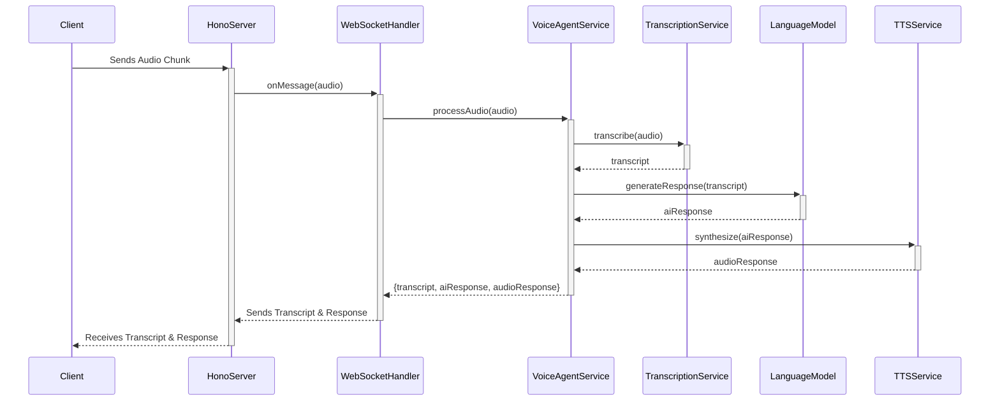

# Voice Agent

This project is a real-time voice agent that listens to audio input, transcribes it to text, generates an intelligent response using a large language model (LLM), and synthesizes the response back into audio.

## Architecture

The application is architected using principles of **Domain-Driven Design (DDD)** to ensure a clean separation of concerns, making the system modular, scalable, and maintainable. The codebase is organized into four main layers:

- **`domain`**: Contains the core business logic and entities of the application, such as `Session`, `Conversation`, and service contracts (`ISessionRepository`, `ILanguageModel`, etc.). This layer is completely independent of any specific technology or framework.
- **`application`**: Orchestrates the use cases of the application by coordinating the domain layer and the infrastructure layer. The `VoiceAgentService` is a key component here, defining the flow for processing audio.
- **`infrastructure`**: Provides concrete implementations for the interfaces defined in the domain layer. This includes implementations for repositories (`InMemorySessionRepository`), external AI services (like `Groq` for STT/TTS and `GoogleLanguageModel` for chat), and other technical concerns.
- **`interfaces`**: The entry point to the application. It handles incoming requests (HTTP, WebSockets) and delegates them to the application layer. It's responsible for web server configuration and WebSocket lifecycle management.

### Architecture Diagram



### Why We Aren't Using a Bun Worker (For Now)

The initial version of this application utilized a `Bun.worker` to offload audio processing and AI service communication from the main server thread. While using workers is a powerful pattern for CPU-intensive tasks, the current architecture has been simplified to handle these operations asynchronously on the main thread.

Here's the rationale behind this design decision:

1.  **I/O-Bound Operations**: The core tasks of transcription, LLM interaction, and text-to-speech are primarily I/O-bound. The application spends most of its time waiting for network responses from external APIs (Groq, Google AI). Bun's event-driven, non-blocking I/O model is highly efficient at handling these asynchronous operations without needing a separate thread.
2.  **Simplicity & Maintainability**: Removing the worker simplifies the architecture. It eliminates the complexity of inter-thread communication (message passing, serialization) and makes the application flow easier to trace and debug within a single context.
3.  **Future Scalability**: The current DDD-based architecture is highly flexible. If future audio processing tasks become CPU-intensive (e.g., complex audio filtering, on-device STT), a worker pool can be cleanly reintroduced as an infrastructure-level concern without altering the core domain or application logic. The `VoiceAgentService` would simply delegate to a worker-based service implementation instead of the current direct-call implementation.

This approach provides a clean, maintainable, and performant baseline while retaining the flexibility to scale up with more complex processing needs in the future.

## Getting Started

### Prerequisites

- [Bun](https://bun.sh/) installed on your machine.

### Installation

1.  Clone the repository:
    ```bash
    git clone https://github.com/samwang0723/voice-agent.git
    cd voice-agent
    ```
2.  Install the dependencies:
    ```bash
    bun install
    ```

### Configuration

The application requires API keys for the AI services it uses. Create a `.env` file in the root of the project and add the following keys:

```env
# Google AI API Key for LLM
GOOGLE_API_KEY="YOUR_GOOGLE_AI_API_KEY"

# Groq API Key for fast STT and TTS
GROQ_API_KEY="YOUR_GROQ_API_KEY"

# Optional: Specify the LLM model to use (defaults to 'gemini-1.5-flash')
# Other options: 'claude-3-haiku', 'gpt-4o' (ensure corresponding API keys are set)
# LLM_MODEL="gemini-1.5-flash"
```

### Running the Application

To start the development server with live-reloading:

```bash
bun dev
```

The server will be running at `http://localhost:3000`. You can open `public/index.html` in your browser to interact with the voice agent.

## Project Structure

```
.
├── src/
│   ├── application/    # Orchestrates use cases
│   ├── domain/         # Core business logic and entities
│   ├── infrastructure/ # Implementations of domain interfaces (DB, AI services)
│   ├── interfaces/     # Entry points (HTTP server, WebSocket handlers)
│   └── index.ts        # Composition root: initializes and wires up the app
├── public/             # Static frontend files
├── package.json
├── tsconfig.json
└── README.md
```
