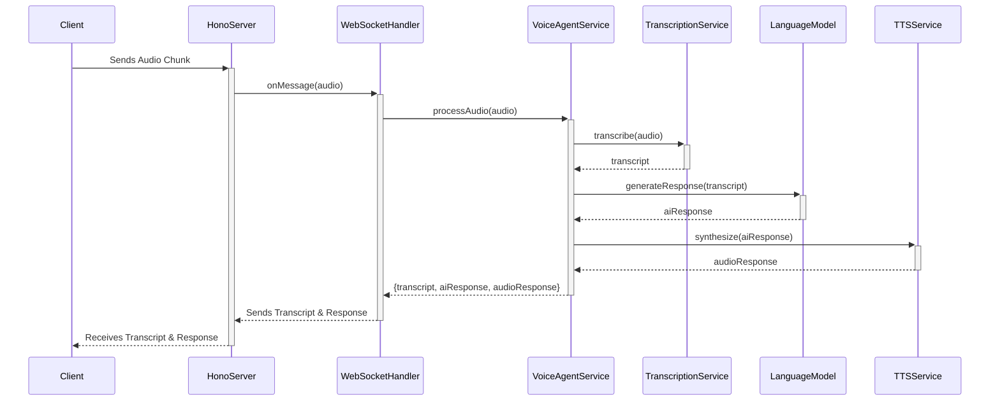

# Voice Agent

This project is a real-time voice agent that listens to audio input, transcribes it to text, generates an intelligent response using a large language model (LLM), and synthesizes the response back into audio.

## Architecture

The application is architected using principles of **Domain-Driven Design (DDD)** to ensure a clean separation of concerns, making the system modular, scalable, and maintainable. The codebase is organized into four main layers:

- **`domain`**: Contains the core business logic and entities of the application, such as `Session`, `Conversation`, and service contracts (`ISessionRepository`, `ILanguageModel`, etc.). This layer is completely independent of any specific technology or framework.
- **`application`**: Orchestrates the use cases of the application by coordinating the domain layer and the infrastructure layer. The `VoiceAgentService` is a key component here, defining the flow for processing audio.
- **`infrastructure`**: Provides concrete implementations for the interfaces defined in the domain layer. This includes implementations for repositories (`InMemorySessionRepository`), external AI services (like `Groq` for STT/TTS and `GoogleLanguageModel` for chat), and other technical concerns.
- **`interfaces`**: The entry point to the application. It handles incoming requests (HTTP, WebSockets) and delegates them to the application layer. It's responsible for web server configuration and WebSocket lifecycle management.

### Architecture Diagram



### Why We Aren't Using a Bun Worker (For Now)

The initial version of this application utilized a `Bun.worker` to offload audio processing and AI service communication from the main server thread. While using workers is a powerful pattern for CPU-intensive tasks, the current architecture has been simplified to handle these operations asynchronously on the main thread.

Here's the rationale behind this design decision:

1.  **I/O-Bound Operations**: The core tasks of transcription, LLM interaction, and text-to-speech are primarily I/O-bound. The application spends most of its time waiting for network responses from external APIs (Groq, Google AI). Bun's event-driven, non-blocking I/O model is highly efficient at handling these asynchronous operations without needing a separate thread.
2.  **Simplicity & Maintainability**: Removing the worker simplifies the architecture. It eliminates the complexity of inter-thread communication (message passing, serialization) and makes the application flow easier to trace and debug within a single context.
3.  **Future Scalability**: The current DDD-based architecture is highly flexible. If future audio processing tasks become CPU-intensive (e.g., complex audio filtering, on-device STT), a worker pool can be cleanly reintroduced as an infrastructure-level concern without altering the core domain or application logic. The `VoiceAgentService` would simply delegate to a worker-based service implementation instead of the current direct-call implementation.

This approach provides a clean, maintainable, and performant baseline while retaining the flexibility to scale up with more complex processing needs in the future.

## Getting Started

### Prerequisites

- [Bun](https://bun.sh/) installed on your machine.

### Installation

1.  Clone the repository:
    ```bash
    git clone https://github.com/samwang0723/voice-agent.git
    cd voice-agent
    ```
2.  Install the dependencies:
    ```bash
    bun install
    ```

### Configuration

The application requires API keys for the AI services it uses. Create a `.env` file in the root of the project and add the following keys:

```env
# Google AI API Key for LLM
GOOGLE_API_KEY="YOUR_GOOGLE_AI_API_KEY"

# Groq API Key for fast STT and TTS
GROQ_API_KEY="YOUR_GROQ_API_KEY"

# Azure Speech Service (for STT and TTS)
AZURE_SPEECH_API_KEY="YOUR_AZURE_SPEECH_API_KEY"
AZURE_SPEECH_REGION="YOUR_AZURE_REGION"  # e.g., "eastus", "westus2", "centralus"
AZURE_TTS_VOICE_ID="en-GB-OllieMultilingualNeural"  # Optional: defaults to en-GB-OllieMultilingualNeural

# Minimax TTS Configuration
MINIMAX_API_KEY="YOUR_MINIMAX_API_KEY"
MINIMAX_TTS_MODEL="speech-02-hd"  # Optional: defaults to speech-02-hd
MINIMAX_VOICE_ID="Wise_Woman"     # Optional: defaults to Wise_Woman

# Optional: Specify the LLM model to use (defaults to 'gemini-1.5-flash')
# Other options: 'claude-3-haiku', 'gpt-4o' (ensure corresponding API keys are set)
# LLM_MODEL="gemini-1.5-flash"
```

### Running the Application

To start the development server with live-reloading:

```bash
bun dev
```

The server will be running at `http://localhost:3000`. You can open `public/index.html` in your browser to interact with the voice agent.

## Supported TTS Providers

The voice agent supports multiple Text-to-Speech (TTS) providers, each with different characteristics:

- **Groq**: Fast TTS with good quality, supports streaming and single-shot modes
- **Azure Speech Service**: High-quality TTS with extensive voice options, supports streaming and single-shot modes
- **ElevenLabs**: Premium voice synthesis with natural-sounding voices, supports streaming and single-shot modes
- **Minimax**: Chinese TTS provider with high-quality voice synthesis, supports both streaming and single-shot modes
  - **Note**: Minimax outputs MP3 format, which may have compatibility considerations for streaming playback compared to PCM-based providers
  - Requires `MINIMAX_API_KEY`, optional `MINIMAX_TTS_MODEL` (defaults to 'speech-02-hd'), and optional `MINIMAX_VOICE_ID` (defaults to 'Wise_Woman')

## Audio & Noise Troubleshooting

### Understanding the Audio Pipeline

The voice agent uses a two-stage audio processing pipeline:

1. **Voice Activity Detection (VAD)** - Detects when speech begins and ends
2. **Noise Reduction (RNNoise)** - Cleans up audio after speech is detected

**Important**: VAD runs _before_ RNNoise in the pipeline. This means background noises (table hits, keyboard clicks, scratching sounds) can trigger false speech detection before the audio gets cleaned by noise reduction.

### Common Issues and Solutions

#### False Speech Triggers from Background Noise

**Problem**: The voice agent starts listening when you hit the table, type on keyboard, or make other non-speech sounds.

**Cause**: VAD thresholds are too permissive, allowing short loud noises to be classified as speech.

**Solutions**:

- Increase `positiveSpeechThreshold` (default: 0.70) to make VAD less sensitive
- Increase `minSpeechFrames` (default: 6) to require longer sustained audio
- Use a quieter environment or position microphone away from noise sources
- Consider using a directional microphone or headset

#### Sensitive Microphone Environments

**Problem**: High-gain microphones pick up too much ambient noise.

**Solutions**:

- Reduce microphone gain in system settings
- Increase VAD thresholds as described above
- Enable RMS energy gating (automatically filters very quiet sounds)

### VAD Parameter Reference

The following parameters control speech detection sensitivity:

| Parameter                 | Default | Description                                | Effect of Higher Values         |
| ------------------------- | ------- | ------------------------------------------ | ------------------------------- |
| `positiveSpeechThreshold` | 0.70    | How easily audio is classified as speech   | Less sensitive to noise         |
| `negativeSpeechThreshold` | 0.50    | Threshold for ending speech detection      | Cleaner speech cutoffs          |
| `minSpeechFrames`         | 6       | Minimum frames required for speech (~64ms) | Requires longer sustained sound |
| `redemptionFrames`        | 4       | How long speech can pause before ending    | Shorter speech tails            |
| `preSpeechPadFrames`      | 1       | Audio captured before speech starts        | More context preservation       |

#### Recommended Settings by Environment

**Quiet Environment (Home office)**:

- `positiveSpeechThreshold`: 0.60-0.70
- `minSpeechFrames`: 4-6

**Noisy Environment (Open office, café)**:

- `positiveSpeechThreshold`: 0.75-0.85
- `minSpeechFrames`: 8-10

**Very Sensitive Microphone**:

- `positiveSpeechThreshold`: 0.80+
- `minSpeechFrames`: 10+
- Enable RMS energy gating

### Debugging VAD Performance

#### Monitoring in Browser Console

The application provides real-time VAD statistics that are logged every 30 seconds. Open your browser's developer console (F12) to view:

```
┌─────────────────────┬────────┐
│ (index)             │ Values │
├─────────────────────┼────────┤
│ False Starts        │ 12     │
│ True Starts         │ 8      │
│ Gate Drops          │ 3      │
│ False Trigger Rate  │ 60.0%  │
└─────────────────────┴────────┘
```

#### Understanding Debug Counters

- **False Starts**: VAD triggered but no actual speech detected (false positives)
- **True Starts**: VAD correctly detected speech
- **Gate Drops**: Audio filtered out by RMS energy gate (too quiet)
- **False Trigger Rate**: Percentage of VAD triggers that were false positives

#### When to Adjust Thresholds

**High False Trigger Rate (>30%)**:

- Increase `positiveSpeechThreshold` by 0.05-0.10
- Increase `minSpeechFrames` by 2-4
- Check for consistent noise sources

**Missing Speech Detection**:

- Decrease `positiveSpeechThreshold` by 0.05
- Decrease `minSpeechFrames` by 1-2
- Check microphone levels and positioning

**Frequent Gate Drops with Good Audio**:

- Decrease `RMS_ENERGY_THRESHOLD` (default: 0.01)
- Check microphone gain settings

#### Manual VAD Tuning

To customize VAD parameters, modify the `DEFAULT_VAD_TUNING` object in `public/script.js`:

```javascript
const DEFAULT_VAD_TUNING = {
  positiveSpeechThreshold: 0.75, // Increase for less sensitivity
  negativeSpeechThreshold: 0.5,
  minSpeechFrames: 8, // Increase to require longer speech
  redemptionFrames: 4,
  preSpeechPadFrames: 1,
  frameSamples: 512,
};
```

Refresh the page after making changes to apply new settings.

## Project Structure

```
.
├── src/
│   ├── application/    # Orchestrates use cases
│   ├── domain/         # Core business logic and entities
│   ├── infrastructure/ # Implementations of domain interfaces (DB, AI services)
│   ├── interfaces/     # Entry points (HTTP server, WebSocket handlers)
│   └── index.ts        # Composition root: initializes and wires up the app
├── public/             # Static frontend files
├── package.json
├── tsconfig.json
└── README.md
```
